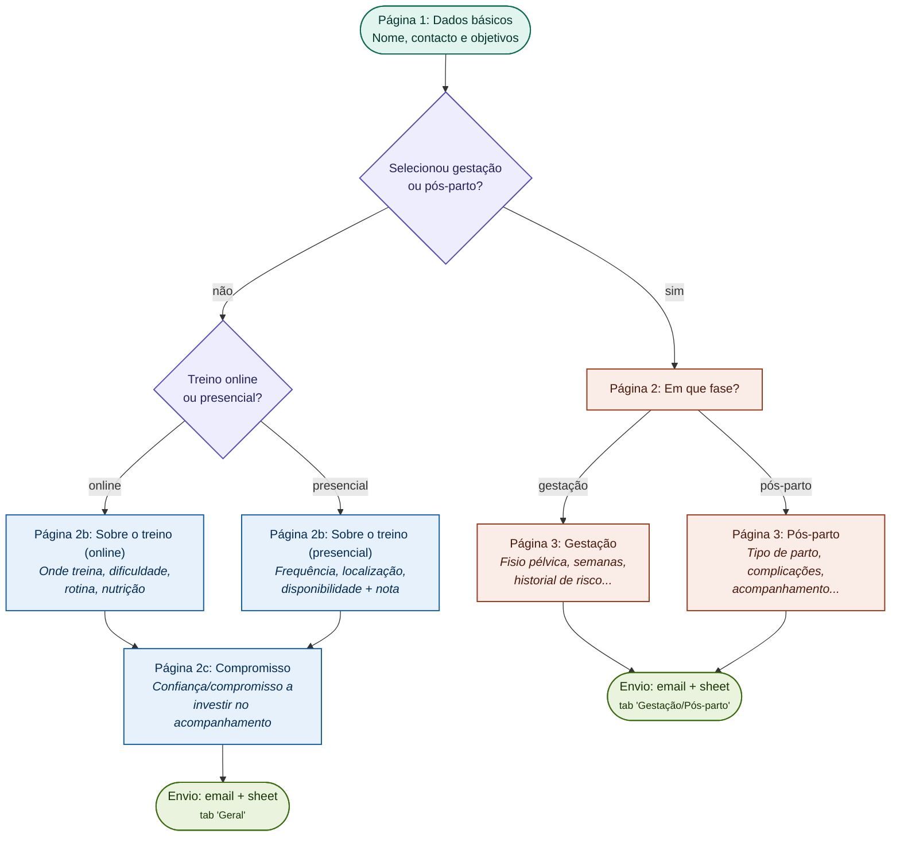
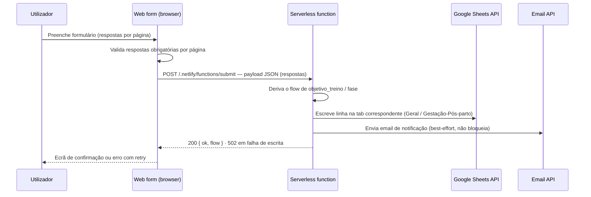
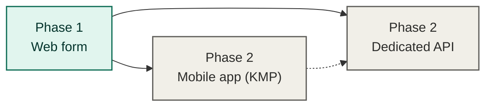

# Ignite Individual Coaching — Web Form

Multi-step web form for Ignite Individual Coaching's lead intake, accessed via a link in the company's Instagram profile. Collects user answers, branches into different question sets depending on the user's training goal, and submits responses to both a company email and a Google Sheet.

## Status

**Phase 1 (current):** static web form, no dedicated backend — a single serverless function handles submission.
**Phase 2 (future):** mobile app (Kotlin Multiplatform) and a dedicated API. Not started yet; this repo covers phase 1 only.

## Tech stack

- **Frontend:** vanilla JavaScript, HTML, CSS (no framework)
- **Backend:** one serverless function (Netlify Functions) — no dedicated backend for phase 1
- **Data destinations:** Google Sheets API (spreadsheet) + transactional email API (e.g. Resend/SendGrid)
- **Localization:** i18n-ready via JSON locale files, starting with `pt-PT` only

## Getting started

Prerequisites: [Node.js](https://nodejs.org/) 22 (see `.nvmrc`; 20.19+ works) and npm.

```bash
npm install
cp .env.example .env   # fill in the values (see "Environment variables" below)
npm run dev             # runs `netlify dev` — serves index.html + functions locally
```

If `npm run dev` isn't available (e.g. `netlify-cli` fails to install), serve the static files directly — the serverless function won't be reachable this way, but the form itself will load:

```bash
python -m http.server 8080
# then open http://localhost:8080
```

## Repository structure

```
ignite-individual-coaching-web/
├── index.html
├── css/
│   └── main.css
├── js/
│   ├── landing.js         # neutral pre-form intro screen (outside the schema)
│   ├── formSchema.js      # steps, fields, and branch conditions (data, not markup)
│   ├── formEngine.js      # renders current step from schema, handles forward/back nav + validation
│   ├── countries.js       # EU/EEA dial codes + parse/combine helpers for the phone field
│   ├── i18n.js            # loads locale JSON, exposes t('key') helper
│   ├── theme.js           # gestacao_posparto palette (bg + accent) + applyTheme (CSS custom props)
│   └── submit.js          # POSTs final payload to the serverless function
├── locales/
│   └── pt-PT.json
├── netlify/
│   └── functions/
│       ├── submit.mjs     # POST handler: derives flow, writes the Sheets row
│       └── lib/
│           ├── columns.mjs  # per-flow column order (derived from formSchema.js)
│           └── sheets.mjs   # Google Sheets v4 client (JWT auth + append)
├── .github/workflows/    # ci.yml (test on PR) + deploy.yml (Netlify on main)
├── netlify.toml
├── docs/
│   ├── field-ids.md      # generated field-ID reference (types, options, conditions)
│   └── qa-checklist.md   # manual end-to-end QA pass (all branches, devices, sign-off)
└── README.md
```

## Form flow

Before the form, a neutral landing screen (`js/landing.js`, copy under `landing.*` in `pt-PT.json`) shows a centered logotype, the intro message, and a "Começar" CTA. It collects no answers, so it lives outside `formSchema.js`; clicking the CTA swaps it for Página 1 with no page reload. The header logo is hidden until then.

From the step **after** `dados_basicos` onward (and the confirmation screen), the page takes a distinct palette **only when `objetivo_treino` includes "Gestação e pós-parto"** — any other objective selection (single or multiple) keeps the default. `js/theme.js` holds the config (`THEME_BY_OBJETIVO`, currently just the `gestacao_posparto` entry) and `applyTheme` writes the palette — background plus accent — onto `:root` as CSS custom properties (`--bg`, `--accent`, `--accent-bright`, `--accent-hover`, `--accent-soft`). The landing screen and `dados_basicos` itself always render neutral (default green / black). Palettes are placeholders until the client delivers finals — only `theme.js` changes then (add more option-id entries there to theme other objectives).

The form is schema-driven: each step is a data object with an optional `condition` function that decides whether it's shown, based on answers collected so far. The schema below mirrors this flowchart exactly — there is no separate page per branch, just conditional steps evaluated at runtime.



### Question set by page

| Page | Fields |
|---|---|
| 1. Dados básicos | Nome (primeiro e último); contacto telefónico e e-mail; como chegou até à Ignite (checkbox + "outro" com texto livre); objetivo(s) de treino (checkbox, múltipla escolha) |
| 2. Treino online ou presencial (ramo geral) | Online ou presencial (radio); encaminha para 2b online ou 2b presencial (issue #50) |
| 2b. Sobre o treino — online | Onde treinas (casa/ginásio); qual a maior dificuldade neste momento (texto livre); como é a tua rotina de treinos (2-3x, 4-5x, 5+/semana); segues orientação alimentar de um nutricionista (sim/não) |
| 2b. Sobre o treino — presencial | Frequência de treino desejada (1x/2x semana); localização preferencial (CrossFit 4475 / Templo Fitness Estúdio); disponibilidade de treino (texto livre); nota de fecho apenas de leitura sobre o contacto pela equipa |
| 2c. Compromisso (ramo geral) | Confiança/compromisso a investir no acompanhamento on-line (sim/não) — sozinho na própria página (issue #45); ambos os sub-ramos convergem aqui |
| 2b. Em que fase (ramo gestação/pós-parto) | Em que fase te encontras — gestação ou pós-parto (radio); encaminha para 3a ou 3b |
| 3a. Gestação | Acompanhamento por fisioterapia pélvica (sim/não); semanas de gravidez (texto); historial de risco segundo obstetra (texto livre); preferência de treino presencial (CrossFit 4475 / Templo Fitness Estúdio); disponibilidade para treino (texto livre); nota de fecho apenas de leitura sobre o contacto pela treinadora |
| 3b. Pós-parto | Tipo de parto (normal/cesariana); complicações durante o parto (texto livre); acompanhada por profissional de exercício físico durante a gravidez (sim/não); acompanhada por fisioterapia pélvica durante a gravidez (sim/não); quanto tempo pós-parto (texto livre); primeira consulta pós-parto com a equipa de obstetrícia (sim/não); preferência de treino presencial; disponibilidade para treino; nota de fecho apenas de leitura sobre o contacto pela treinadora |

Each field has a stable ID (e.g. `nome`, `objetivo_treino`, `fase`, `semanas_gravidez`) used consistently across the form schema, the locale file, the submitted payload, and the spreadsheet columns — only the *display label* changes per locale, never the ID. The full field-ID list (types, options, branch conditions) is documented in [`docs/field-ids.md`](docs/field-ids.md).

## Submission flow



**Implemented (issue #14):** the browser POSTs the flat `answers` object to
`/.netlify/functions/submit`. The function derives the flow itself
(`gestacao_posparto` when `objetivo_treino` includes it, else `geral`), maps
it to a tab (`Geral` / `Gestação-Pós-parto`), and appends a row via the
Google Sheets API — writing the field-id header row first if the tab is
empty. Column order lives in `netlify/functions/lib/columns.mjs`, derived
from `formSchema.js`. A failed Sheets write returns **502** and the browser
shows the retry screen; the spreadsheet is the source of truth.

**Notification email (issue #15):** after the Sheets write, the function sends
one email to `COMPANY_EMAIL_TO` via Resend. The template matches the flow
(`Geral` / `Gestação/Pós-parto`) and lists only that branch's filled fields
with their pt-PT question labels — labels are resolved server-side from
`formSchema.js` + `locales/pt-PT.json` in `netlify/functions/lib/labels.mjs`;
rendering and send live in `netlify/functions/lib/email.mjs`. The email is
**best-effort**: a failure (or missing `EMAIL_*` config) is logged and the
submission still returns **200**. The subject line is a placeholder pending
approved copy.

**Client-side wiring (issue #16):** the browser side of this flow — building the
POST, showing a loading state (`form.nav.submitting` → "A enviar…" plus
`aria-busy` on `#form-root` while in flight), and routing to the success or
error/retry screen off the real response — lives in `js/submit.js` and
`runSubmit` in `js/formEngine.js`. `timestamp` (`submitted_at`) and `flow` are
derived server-side by design, so the client POSTs the flat `answers` object
unmodified. This was largely delivered ahead of #16 by issues #11/#14/#15; #16
added the visible loading affordance and removed the `__MOCK_SUBMIT_FAIL`
development hook.

> Issue #13 ("serverless function scaffold and environment config") was closed
> as superseded — #14 delivered the handler, `netlify.toml` functions config,
> and `.env.example` vars ahead of it, and replaced the planned mocked success
> with the real Sheets write.

### Google Sheets setup

1. Google Cloud project → enable the **Google Sheets API**.
2. Create a **service account**; download its JSON key.
3. Create the spreadsheet with two tabs named exactly **`Geral`** and
   **`Gestação-Pós-parto`** (leave them empty — headers are written on the
   first submission).
4. Share the spreadsheet with the service-account email as **Editor**.
5. Set `GOOGLE_SHEETS_CLIENT_EMAIL`, `GOOGLE_SHEETS_PRIVATE_KEY` (the
   `\n`-escaped `private_key` from the JSON), and `GOOGLE_SHEETS_SPREADSHEET_ID`
   locally in `.env` and in **Netlify → Site settings → Environment variables**.

### Email setup

1. Create a **[Resend](https://resend.com)** account and an API key.
2. Verify a sending domain (production). For local/test sends, Resend's
   `onboarding@resend.dev` sender works without a domain.
3. Set locally in `.env` and in **Netlify → Site settings → Environment
   variables**:
   - `EMAIL_API_KEY` — the Resend API key
   - `COMPANY_EMAIL_TO` — `individualcoaching.fial@gmail.com`
   - `EMAIL_FROM` — the verified sender address
4. With any of the three unset, the function logs `[email] not configured,
   skipping` and the submission still succeeds.
5. A real email sends **only in the Netlify `production` context**. Outside it
   (deploy previews, branch deploys, `netlify dev`, direct invocation) the
   function logs `[email] non-production context, skipping notification`. Set
   `EMAIL_FORCE=1` to force a real send outside production for manual testing.

## CI/CD

GitHub Actions (`.github/workflows/`):

- **`ci.yml`** — on every PR and non-`main` push: `npm ci` + `npm test`.
- **`deploy.yml`** — on push to `main`: tests, then
  `node scripts/stamp-assets.mjs` (appends `?v=<commit sha>` to the CSS link and
  the JS module graph so each deploy busts client caches), then
  `netlify-cli deploy --prod`. `_headers` gives the stamped `/css/*` and `/js/*`
  a one-year `immutable` cache while `index.html` stays `must-revalidate`.
  The stamp runs only in CI — it rewrites the checked-out tree, nothing committed.

`npm test` (node:test + jsdom) covers the schema branch predicates, the engine's
navigation / validation / submit, full button-by-button walks of all three
branches, mid-flow branch switching, and the per-flow spreadsheet rows. Before a
release, also run the manual pass in [`docs/qa-checklist.md`](docs/qa-checklist.md)
— real-device rendering, the live Google Sheet, and the notification email, which
the automated suite can't see.

Repo secrets required: `NETLIFY_AUTH_TOKEN` (Netlify user → Applications →
personal access token) and `NETLIFY_SITE_ID` (Netlify site → Site settings →
General → Site ID). Runtime `GOOGLE_SHEETS_*` vars live in the Netlify site,
not in GitHub. Disable Netlify's own auto Git deploy so Actions is the only
deploy path.

## Deployment

Production runs on Netlify, deployed only via `deploy.yml` (never Netlify's own
Git integration). Live URL: `https://ignite-coaching.netlify.app`.

Full setup, environment-variable, HTTPS, and post-deploy verification steps are
in [`docs/deployment.md`](docs/deployment.md). Launching on the default
`*.netlify.app` subdomain; a custom domain is deferred.

## Localization

Locale files live in `/locales`, keyed by translation ID, not by page:

```json
{
  "form.step1.nome": "Nome (primeiro e último)",
  "form.step1.como_chegou.label": "Como chegou até à Ignite?",
  "form.objetivo.gestacao_posparto": "Acompanhamento gestação e pós-parto"
}
```

Only `pt-PT.json` exists today. Adding a new language later means adding a new JSON file with the same keys — no changes to `formSchema.js`, `formEngine.js`, or the branch logic.

## Environment variables

Set locally in `.env` (never committed — see `.gitignore`) and in the Netlify dashboard for production:

```
GOOGLE_SHEETS_CLIENT_EMAIL=
GOOGLE_SHEETS_PRIVATE_KEY=
GOOGLE_SHEETS_SPREADSHEET_ID=
EMAIL_API_KEY=
COMPANY_EMAIL_TO=
EMAIL_FROM=
```

## Roadmap



When phase 2 starts, mobile and backend will live in separate repositories (`ignite-individual-coaching-mobile`, `ignite-individual-coaching-api`), keeping this repo scoped to the web form only.

## License

Proprietary — all rights reserved, © Ignite Individual Coaching.
