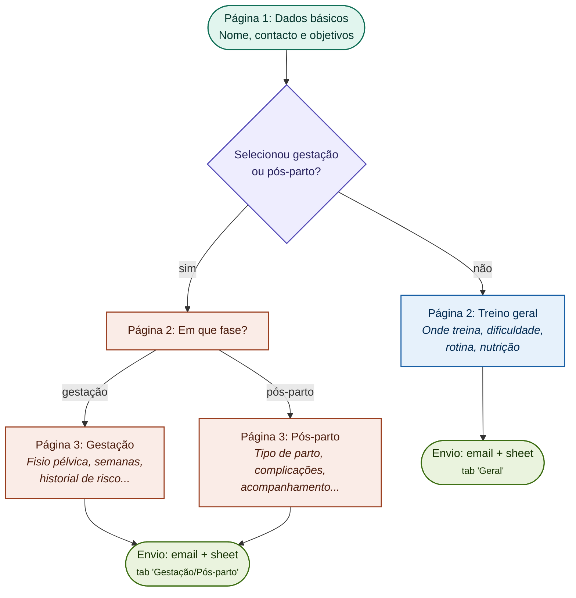
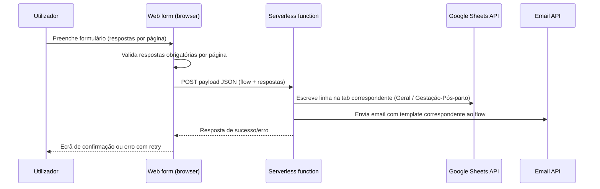
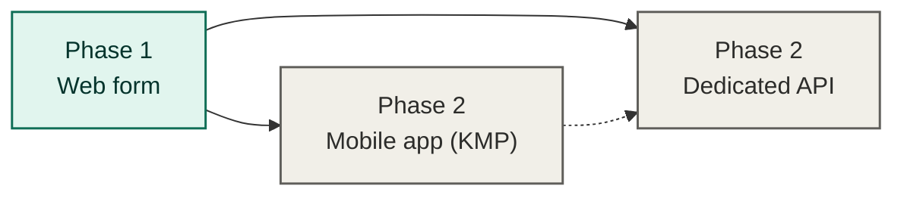

# Ignite Individual Coaching — Web Form

Multi-step web form for Ignite Individual Coaching's lead intake, accessed via a link in the company's Instagram profile. Collects user answers, branches into different question sets depending on the user's training goal, and submits responses to both a company email and a Google Sheet.

## Status

**Phase 1 (current):** static web form, no dedicated backend — a single serverless function handles submission.
**Phase 2 (future):** mobile app (Kotlin Multiplatform) and a dedicated API. Not started yet; this repo covers phase 1 only.

## Tech stack

- **Frontend:** vanilla JavaScript, HTML, CSS (no framework)
- **Backend:** one serverless function (Netlify Functions) — no dedicated backend for phase 1
- **Data destinations:** Google Sheets API (spreadsheet) + transactional email API (e.g. Resend/SendGrid)
- **Localization:** i18n-ready via JSON locale files, starting with `pt-PT` only

## Getting started

Prerequisites: [Node.js](https://nodejs.org/) (18+) and npm.

```bash
npm install
cp .env.example .env   # fill in the values (see "Environment variables" below)
npm run dev             # runs `netlify dev` — serves index.html + functions locally
```

If `npm run dev` isn't available (e.g. `netlify-cli` fails to install), serve the static files directly — the serverless function won't be reachable this way, but the form itself will load:

```bash
python -m http.server 8080
# then open http://localhost:8080
```

## Repository structure

```
ignite-individual-coaching-web/
├── index.html
├── css/
│   └── main.css
├── js/
│   ├── formSchema.js      # steps, fields, and branch conditions (data, not markup)
│   ├── formEngine.js      # renders current step from schema, handles forward/back nav + validation
│   ├── countries.js       # EU/EEA dial codes + parse/combine helpers for the phone field
│   ├── i18n.js            # loads locale JSON, exposes t('key') helper
│   └── submit.js          # POSTs final payload to the serverless function
├── locales/
│   └── pt-PT.json
├── netlify/
│   └── functions/
│       └── submit.js      # Sheets write + email send
├── netlify.toml
├── docs/
│   └── field-ids.md      # generated field-ID reference (types, options, conditions)
└── README.md
```

## Form flow

The form is schema-driven: each step is a data object with an optional `condition` function that decides whether it's shown, based on answers collected so far. The schema below mirrors this flowchart exactly — there is no separate page per branch, just conditional steps evaluated at runtime.



### Question set by page

| Page | Fields |
|---|---|
| 1. Dados básicos | Nome (primeiro e último); contacto telefónico e e-mail; como chegou até à Ignite (checkbox + "outro" com texto livre); objetivo(s) de treino (checkbox, múltipla escolha) |
| 2a. Treino geral | Onde treinas (casa/ginásio); qual a maior dificuldade neste momento (texto livre); como é a tua rotina de treinos (2-3x, 4-5x, 5+/semana); segues orientação alimentar de um nutricionista (sim/não); confiança/compromisso a investir no acompanhamento on-line (sim/não) |
| 2b. Em que fase | Gestação ou pós-parto (checkbox) |
| 3a. Gestação | Acompanhamento por fisioterapia pélvica (sim/não); semanas de gravidez (texto); historial de risco segundo obstetra (texto livre); preferência de treino presencial (CrossFit 4475 / Templo Fitness Estúdio); disponibilidade de horário (2ª, 3ª, 4ª, 6ª — texto livre); aviso de contacto pela treinadora |
| 3b. Pós-parto | Tipo de parto (normal/cesariana); complicações no parto (texto livre); acompanhamento por profissional de exercício físico na gravidez (sim/não); acompanhamento por fisioterapia pélvica na gravidez (sim/não); tempo pós-parto (texto livre); primeira consulta pós-parto com obstetrícia (sim/não); preferência de treino presencial; disponibilidade de horário; aviso de contacto pela treinadora |

Each field has a stable ID (e.g. `nome`, `objetivo_treino`, `fase`, `semanas_gravidez`) used consistently across the form schema, the locale file, the submitted payload, and the spreadsheet columns — only the *display label* changes per locale, never the ID. The full field-ID list (types, options, branch conditions) is documented in [`docs/field-ids.md`](docs/field-ids.md).

## Submission flow



The spreadsheet write is treated as the source of truth (retried/alerted on failure); the email is a notification and can fail without blocking the submission.

## Localization

Locale files live in `/locales`, keyed by translation ID, not by page:

```json
{
  "form.step1.nome": "Nome (primeiro e último)",
  "form.step1.como_chegou.label": "Como chegou até à Ignite?",
  "form.objetivo.gestacao_posparto": "Acompanhamento gestação e pós-parto"
}
```

Only `pt-PT.json` exists today. Adding a new language later means adding a new JSON file with the same keys — no changes to `formSchema.js`, `formEngine.js`, or the branch logic.

## Environment variables

Set locally in `.env` (never committed — see `.gitignore`) and in the Netlify dashboard for production:

```
GOOGLE_SHEETS_CLIENT_EMAIL=
GOOGLE_SHEETS_PRIVATE_KEY=
GOOGLE_SHEETS_SPREADSHEET_ID=
EMAIL_API_KEY=
COMPANY_EMAIL_TO=
```

## Roadmap



When phase 2 starts, mobile and backend will live in separate repositories (`ignite-individual-coaching-mobile`, `ignite-individual-coaching-api`), keeping this repo scoped to the web form only.

## License

Proprietary — all rights reserved, © Ignite Individual Coaching.
